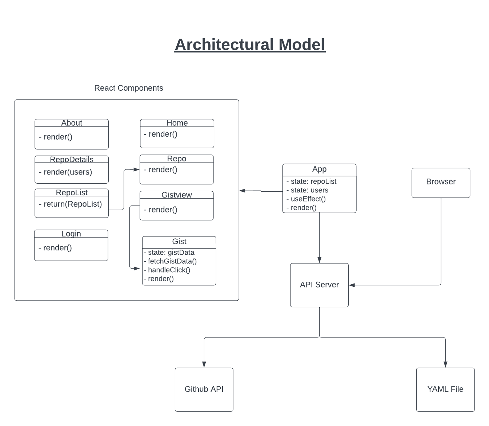

# Release 4

### Step 1
Install all dependencies
```
npm install
```
### Step 2
Create .env file with REACT_APP_GITHUB_ACCESS_TOKEN
```
REACT_APP_GITHUB_ACCESS_TOKEN={Token Goes Here}
```
### Step 3
```
node server/server.js
```
### Step 4
```
npm start
```
### Step 5
1. Go to the Gist page by clicking Gist Button
2. Click on Fetch Gist Button to display the Gist
